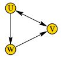
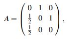
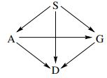
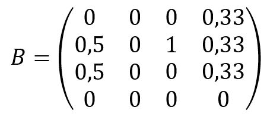

# PageRank
## 6.1 Aufgabe: Der Algorithmus
Der PageRank bewertet die Wichtigkeit einer Webseite auf ähnliche Weise, wie sich auch Trampelpfade von Ameisen entwickeln (hier entspricht die Anzahl der Links der Menge eines Duftstoffs). So sieht man umgekehrt sofort ein, dass bei sich zufällig durchs Web klickenden Surfern ("Ameisen") die Anzahl der Besucher auf einer gegebenen Webseite die gewichtete Anzahl der Links auf diese Seite ist. Für das folgende Netzwerk beispielsweise ergibt sich daraus

nach dem Skript die modizierte Adjazenzmatrix _A_:

(a) Wie lautet das entsprechende Gleichungssystem für das folgende Netz?

> **Antwort**:
> Das folgende Netz ergibt folgende Matrix:

(b) Programmieren Sie den PageRank-Algorithmus und berechnen Sie damit für das "Mini-Web" in (a) die PageRanks mit dem Dämpfunsfaktor _d_ = 0,85 für die ersten 3 Iterationsschritte.

(* c) Laden Sie sich die Java-Quelltextdateieen zur PageRank-Berechnng eines "Mini-Webs" von http://haegar.fh-swf.de/PageRank/java-source.zip herunter (enthält ein Spider genanntes Web-Crawler-Programm, das möglichst nicht auf fremde Webseiten angewandt werden sollte, da es sich an keine robot-Restriktionen hält ...) und erstellen Sie auf Ihrem Webserver ein kleines Netz aus vier Webseiten mit obiger Linkstruktur. Wie lauten die PageRanks?